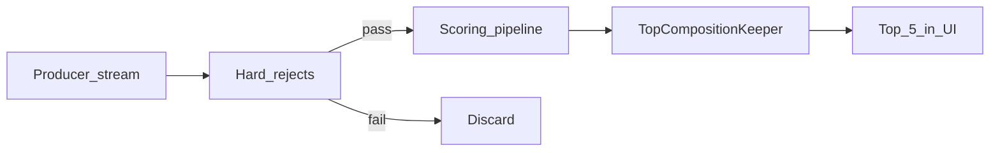
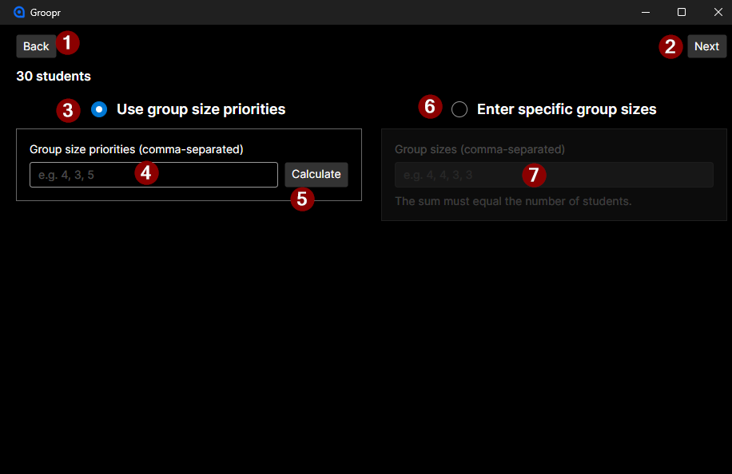
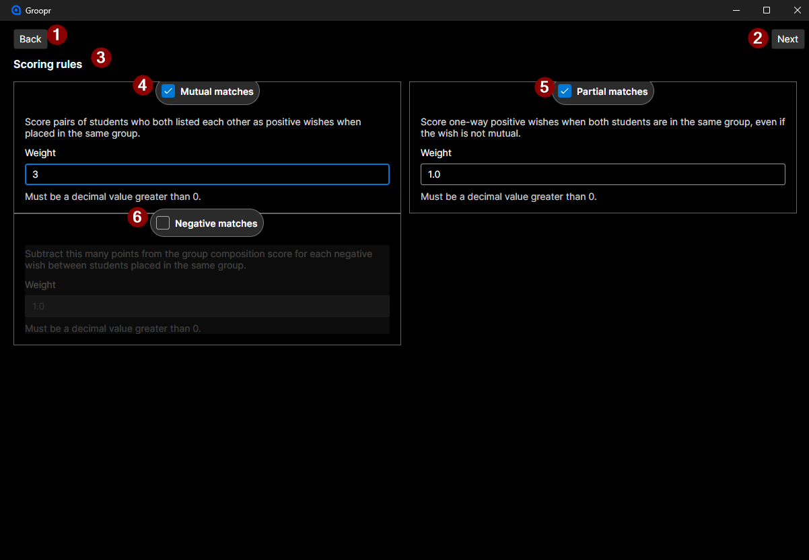
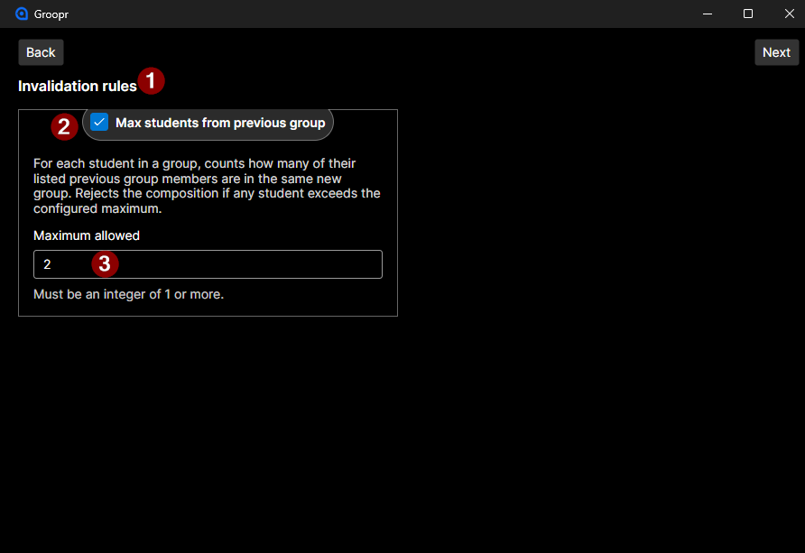
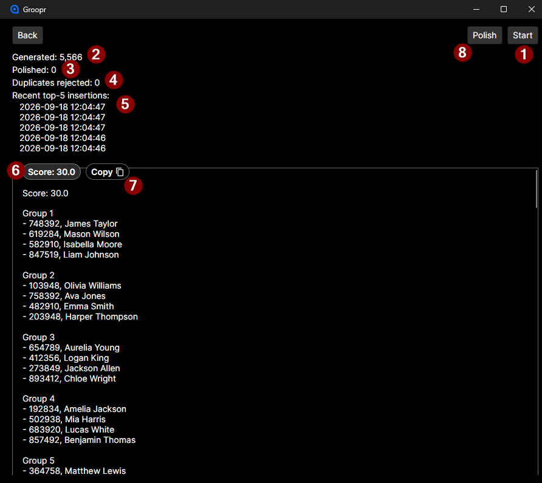
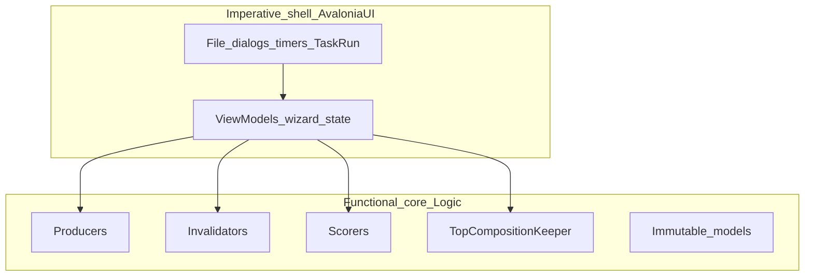

# Groopr

Groopr is a desktop app that helps teachers divide students into groups.

Students can supply optional preferences—who they want to work with, who they prefer not to, and who they were grouped with previously. Groopr generates many candidate **group compositions**, scores them against configurable rules, and keeps a rolling top list so the teacher can pick a strong partition.

Detailed requirements live in [SRS.md](SRS.md).

## Domain concepts

- **Student** — number, optional name, positive wishes, negative wishes, and previous group members.
- **Group** — a list of students.
- **GroupComposition** — a full partition of the class into groups, plus a total score once evaluated.
- **Blueprint** — the exact group sizes for this run (e.g. `[4, 4, 3]`). Sizes must sum to the number of students; every generated composition matches this template.

A composition is **structurally valid** when it is an exact partition of the student pool into the blueprint (no missing or duplicate students). That is separate from **hard rejects** (configurable invalidation rules), which can discard a structurally valid composition before scoring.

Two compositions are treated as the same if they contain the same groups by student number only. Order of groups and of students within a group does not matter.

## How search works

Groopr uses a Monte Carlo loop with elitism (the “Dinner” engine):

1. A **producer** yields an infinite stream of structurally valid, unscored compositions.
2. **Hard rejects** discard invalid candidates before scoring.
3. The **scoring pipeline** assigns a fitness score.
4. The **TopCompositionKeeper** retains a Top 5 list. A new composition replaces the lowest score if it is better and not a duplicate partition.

Generation runs until you stop it. Afterward, a separate **Polish** pass can hill-climb each retained composition in place (~15 random inter-group swaps). Polish never pushes compositions out of the top list; it only improves slots that get strictly better (and still pass hard rejects). Polish and generation are mutually exclusive.



## Scoring and invalidation

**Scorers** (weights configurable; at least one must be enabled):

| Rule | Effect |
| --- | --- |
| Mutual match | Points when two students listed each other positively and share a group |
| Partial match | Points when a one-way positive wish is satisfied |
| Negative match | Subtracts points when students with a negative wish share a group |

Scores are additive per group; a composition’s total is the sum of its groups’ contributions.

**Invalidators** (hard rejects before scoring):

| Rule | Effect |
| --- | --- |
| Max students from previous group | Rejects compositions that reuse too many classmates from a prior group |

## Generation strategies

All strategies implement the same producer interface and return structurally valid partitions. Wish-aware strategies typically randomize once per composition so the Monte Carlo loop explores variety.

The desktop app currently generates with **RoundRobin** (see below). Other strategies are available in Logic and in the benchmark project. Polish uses **HillClimbing** on the retained top list only.

### Baseline

**RandomShuffle** — Shuffles the student pool and slices it sequentially into the blueprint sizes. Does not use wishes while generating.

### Wish-greedy fill

**BreadthFirstGreedy** — Seeds each group from the shuffled pool, then expands by taking an available positive wish from the earliest group member who still has one. Falls back to the next unassigned student when stuck.

**DepthFirstGreedy** — Same idea, but always expands from the most recently added student (a chain walk). When that tip has no available wishes, picks a random unassigned student and continues from them.

### Seeding variants

These strategies choose smarter seeds, then typically fill with BFS-style wish expansion.

**MutualPairFirst** — Finds mutual positive-wish pairs, seeds a group with a pair when size allows, then fills remaining seats greedily.

**OrphanFirst** — Orders students by how often others wish for them (least wished-for first), seeds each group with an isolated student, then fills greedily.

**TriadFirst** — Detects directed wish triangles (A→B→C→A), seeds with a triangle when group size ≥ 3 (otherwise mutual pair / random), then fills greedily.

**IslandFirst** — Finds connected components in the undirected positive-wish graph (“friend islands”), prefers seeding with the largest island that still fits, then fills greedily.

### Scorer-guided

These strategies need a `GroupCompositionScorer` and use affinity / score impact while building groups.

**MatrixWindowScan** — Scores all student dyads, seeds each group with the best still-available dyad, then greedily expands by marginal score impact until the blueprint size is filled.

**EdgeContractionMatching** — Agglomerative clustering: students start as singletons; highest-affinity edges are contracted while respecting max group size, then members are rebalanced to the exact blueprint.

### Meta and refinement

**RoundRobin** — Cycles through child strategies in phases (default: MutualPairFirst → OrphanFirst → TriadFirst → MatrixWindowScan, 1000 compositions each) so the search budget is shared. This is the UI default producer.

**HillClimbingWrapper** — Refinement via random student swaps between groups, keeping improvements (per-group delta scoring). Can wrap an inner producer, or polish an existing composition. The UI Polish button uses a short polish-only run (~15 iterations).

**SimulatedAnnealingWrapper** — Like hill climbing, but accepts some worse swaps via the Metropolis rule while temperature cools, tracking a global best layout separately from the current state.

### Planned

**SlidingWindow** — Planned; not implemented yet.

## User interface

The desktop app is a linear wizard. Screenshots will go under `docs/images/`—placeholders below.

### 1. Student Data

Enter or edit students (number, name, positive/negative wishes, previous group members). Download a CSV template or import a CSV (import replaces the current list).


<!-- TODO: screenshot -->

### 2. Group Sizing

Choose a size blueprint: priority-based calculation or a manual list of group sizes. The sizes must sum to the student count.



<!-- TODO: screenshot -->

### 3. Scorer Setup

Enable scoring rules and set weights (mutual, partial, negative matches).



<!-- TODO: screenshot -->

### 4. Invalidation Setup

Optionally enable hard rejects (e.g. max students from a previous group).



<!-- TODO: screenshot -->

### 5. Group Composition Generation

Start/Stop the Monte Carlo search. The view shows the Top 5 compositions with scores, generation counters (generated, duplicates rejected), recent acceptance timestamps, and a **Polish** / **Stop polishing** control for hill-climbing the current top list.



<!-- TODO: screenshot -->


<!-- TODO: screenshot -->


<!-- TODO: screenshot -->

## Architecture

Groopr follows an **imperative shell, functional core** split.



**Functional core (`Logic`)** — Domain models, group sizing, CSV parsing, generation strategies, scorers, invalidators, and the top-list keeper. Prefer pure, testable code with no UI dependencies. Compositions and groups are record-style models; producers yield unscored partitions; scorers and invalidators are pluggable.

**Imperative shell (`AvaloniaUI`)** — Wizard navigation, mutable input configuration, file dialogs, background loops with cancellation, and UI refresh. ViewModels map configuration into Logic types and run the generate → reject → score → keep loop.

### Projects

| Project | Role |
| --- | --- |
| `Logic/` | Domain and algorithms |
| `AvaloniaUI/` | Desktop shell (Avalonia + MVVM) |
| `UnitTests/` | xUnit tests focused on Logic |
| `GroupGenerationBenchmark/` | Console benchmark for strategy speed and score quality |
| `TestData/` | Sample student fixtures |

### Development approach

Logic is developed with a dual-agent TDD workflow: one agent writes unit tests from the requirements; a second implements the code **without reading the tests**. The goal is that tests and implementation are independent interpretations of the same spec. If both agree, confidence is high; if they disagree, something was misunderstood. Tests are not skipped or disabled.

## Tech stack

- .NET 10
- Avalonia UI (desktop)
- CsvHelper (student import)
- xUnit
- Blazor WASM planned for a future web UI

## Getting started

```bash
dotnet build Groopr.sln
dotnet run --project AvaloniaUI
dotnet test UnitTests
dotnet run --project GroupGenerationBenchmark
```

CSV import expects columns: `StudentNumber`, `Name`, `PositiveWishes`, `PreviousGroupMembers`, `NegativeWishes` (wish/member lists are comma-separated student numbers). The app can download a template with example rows.

## Benchmarks

Condensed results from `GroupGenerationBenchmark` (full histograms omitted). Regenerate with:

```bash
dotnet run --project GroupGenerationBenchmark
```

### 30 students, 100,000 generations

Fixture based on TestData (30 students). Blueprint `[4, 4, 4, 4, 4, 4, 3, 3]`. Scorers: MutualMatch=3, PartialMatch=1, NegativeMatch=3.

**Generation speed**

| Strategy | Elapsed | Rate (comp/s) |
| --- | --- | --- |
| RandomShuffle | 284.5ms | 351,511 |
| BreadthFirstGreedy | 726.0ms | 137,744 |
| DepthFirstGreedy | 507.7ms | 196,951 |
| MutualPairFirst | 1.091s | 91,686 |
| OrphanFirst | 714.3ms | 139,997 |
| TriadFirst | 1.869s | 53,513 |
| IslandFirst | 1.619s | 61,779 |
| MatrixWindowScan | 88.199s | 1,134 |
| EdgeContraction | 199.341s | 502 |
| HillClimbing | 25.045s | 3,993 |
| SimulatedAnnealing | 578.218s | 173 |
| RoundRobin | 1.198s | 83,486 |

**Score quality**

| Strategy | Max | Mean | Median | StdDev | Min |
| --- | --- | --- | --- | --- | --- |
| RandomShuffle | 16 | 4.16 | 4 | 2.98 | -7 |
| BreadthFirstGreedy | 29 | 16.91 | 17 | 3.62 | 0 |
| DepthFirstGreedy | 28 | 15.45 | 16 | 3.51 | -1 |
| MutualPairFirst | 28 | 19.86 | 20 | 2.62 | 8 |
| OrphanFirst | 25 | 18.41 | 19 | 2.59 | 6 |
| TriadFirst | 25 | 17.03 | 17 | 3.34 | 6 |
| IslandFirst | 29 | 16.92 | 17 | 3.64 | 1 |
| MatrixWindowScan | 29 | 25.66 | 26 | 1.35 | 19 |
| EdgeContraction | 29 | 26.12 | 26 | 1.27 | 20 |
| HillClimbing | 29 | 22.81 | 23 | 1.99 | 14 |
| SimulatedAnnealing | 28 | 21.24 | 21 | 1.86 | 14 |
| RoundRobin | 28 | 18.43 | 19 | 3.09 | 5 |

### 50 students, 100,000 generations

Fixture: Students50. Blueprint `[4, 4, 4, 4, 4, 4, 4, 4, 4, 4, 4, 3, 3]`. Same scorer weights.

**Generation speed**

| Strategy | Elapsed | Rate (comp/s) |
| --- | --- | --- |
| RandomShuffle | 406.3ms | 246,142 |
| BreadthFirstGreedy | 1.125s | 88,857 |
| DepthFirstGreedy | 796.5ms | 125,543 |
| MutualPairFirst | 1.582s | 63,203 |
| OrphanFirst | 1.395s | 71,683 |
| TriadFirst | 3.043s | 32,859 |
| IslandFirst | 2.655s | 37,670 |
| MatrixWindowScan | 273.177s | 366 |
| EdgeContraction | 628.281s | 159 |
| HillClimbing | 32.890s | 3,040 |
| SimulatedAnnealing | 1136.364s | 88 |
| RoundRobin | 1.868s | 53,530 |

**Score quality**

| Strategy | Max | Mean | Median | StdDev | Min |
| --- | --- | --- | --- | --- | --- |
| RandomShuffle | 24 | 3.07 | 3 | 4.51 | -24 |
| BreadthFirstGreedy | 68 | 50.32 | 51 | 5.74 | 22 |
| DepthFirstGreedy | 67 | 44.49 | 45 | 6.21 | 16 |
| MutualPairFirst | 69 | 56.78 | 57 | 4.97 | 30 |
| OrphanFirst | 65 | 49.52 | 50 | 4.9 | 24 |
| TriadFirst | 68 | 58.16 | 59 | 4.56 | 33 |
| IslandFirst | 68 | 50.38 | 51 | 5.72 | 21 |
| MatrixWindowScan | 68 | 62.87 | 63 | 2.75 | 45 |
| EdgeContraction | 69 | 66.65 | 67 | 1.72 | 58 |
| HillClimbing | 68 | 59.22 | 60 | 3.68 | 37 |
| SimulatedAnnealing | 69 | 57.06 | 58 | 4.72 | 34 |
| RoundRobin | 68 | 54.85 | 55 | 6.12 | 24 |

## Roadmap

- More student criteria (DISC profile, physical location)
- SlidingWindow generation strategy
- Additional scorers and invalidators
- Blazor WASM web UI
